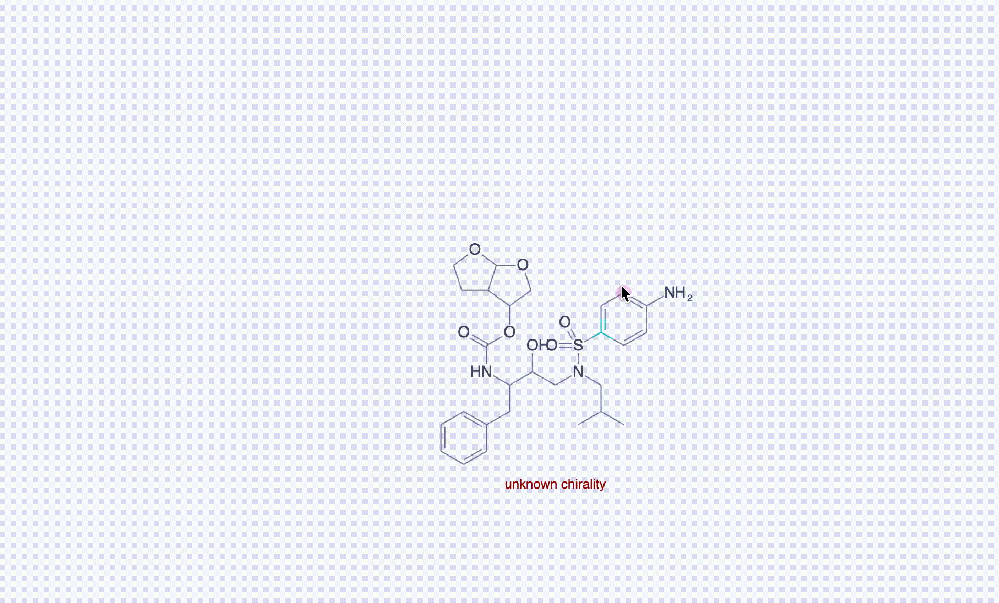

# Streamlit Molecular Selection



## Install
```bash
pip install streamlit-molecular-selection
```


## Usage

```python
import streamlit as st
#st.write(st_molecule_selection('CC(C)CN(CC(C(CC1CCCCC1)NC(OC1C(CCO2)C2OC1)=O)O)S(C(CC1)CCC1N)(=O)=O', height=100))
st.write(st_molecule_selection('CC(C)CN(CC(C(CC1CCCCC1)NC(OC1C(CCO2)C2OC1)=O)O)S(C(CC1)CCC1N)(=O)=O', nop_selection=True, 
                                preset_selections=[0, 1, 2, 4, 5],
                                key='2'))

with open('examples/3d20_ligand.sdf') as f:
    st.write(st_molecule_selection(f.read(), ftype='mol', key='4'))
```